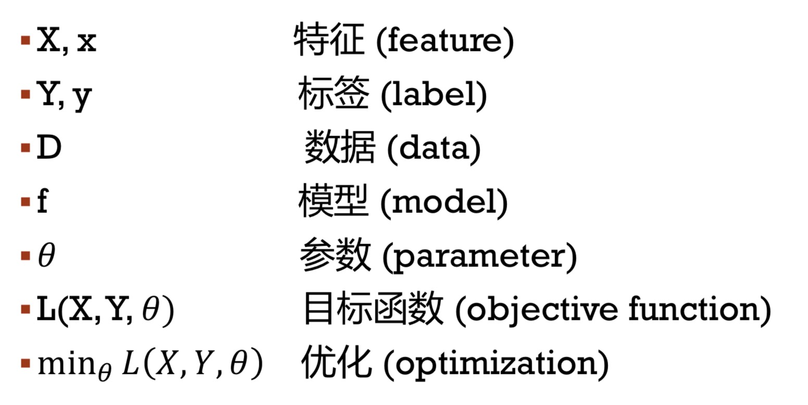

# 机器学习中的数学3-概率论简介

[TOC]

## 符号简介

## 概率

- 事件发生可能的大小 (0~1)
  - 0 - 不可能发生(直观上)
  - 1 - 一定会发生(直观上)
  - 0.1 - 平均十次事件会发生一次

**并不是说0就一定不会发生，1就一定会发生，这都是直观上的，还是有发生这个事件的可能性**

## 事件、集合

- 一个随机的过程的结果
  - 掷色子， 可能的结果 Ω = {1，2，3，4，5，6}
  - 判断垃圾邮件， Ω = {0, 1}
  - 判断推荐链接是否有效， Ω = {0, 1}
  - 预测股票价格 Ω = [0, 100]
  - 𝑃(Ω) = 1

**Ω代表全集，{}的为离散，[]的为连续**

- 并集
  - 如果A，B互斥，那么P(A or B) = P(A) + P(B)

  - 掷骰子 是 {1,2} 或者 {3,4}的概率为 
  
    

  - 是 {1,2} 或者 {2,3}的概率 不是 
    
    

  - 

    - 骰子结果**是3**和**不是3**的概率和为**1**

  - 假设一共有n种互斥的可能，那么 
    
    

- 独立事件

  - P(A ∩ B) = P (A) ∗ P(B) 那么A和B是独立的
    - 直观: A的发生与否对B没有影响
    - 掷三次硬币，正反反的概率为1/2 * 1/2 * 1/2
    - 收到三封邮件，都是垃圾邮件的概率为 0.01 * 0.01 * 0.01（假设收到垃圾邮件的概率为0.01）
    - 收到三封来自同一邮箱的邮件，都是垃圾邮件的概率（不是独立事件，不能单纯直接相乘）
    - **大部分情况下，机器学习模型假设数据是独立的**
  - ​
